# Cy2Unity 编辑器 说明文档与注意事项

## 版本号：0.1.0

'以下内容版权归@CN115所有'

### 一、开始使用

请在群文件中根据自己的设备选择合适的编辑器文件的压缩包进行下载。笔者此处以X86_64位系统做说明。

解压后，你将看到如下文件：

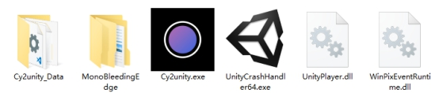 

双击Cy2uinty.exe来打开编辑器。

一段时间后你将会看到如下画面：

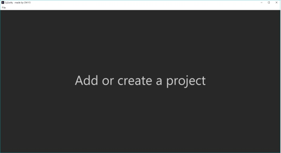你可以在左上角“File”选择新建（Create Project）或者导入（Open Project）工程。

如果你新建工程，将会要求你导入一个音乐文件（.wav/.ogg）。

此处我们选择姜米条的《光》。

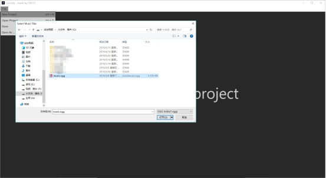 

导入后，编辑器会要求输入一个默认的BPM。

 

请注意，BPM可以在进入编辑器后修改，或设置多BPM。请尽可能在此处设置一个合适的值。

输入完成后，编辑器会再要求你输入一个默认的每页长度。如下。

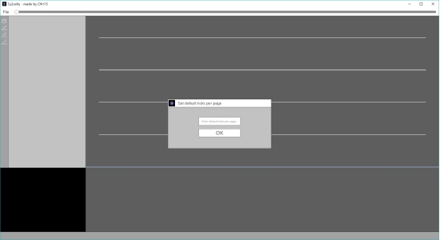 

C2谱面文件的每一拍的长度是480个时间单位。即，如果希望每页包含两拍，此处应该输入“960”，同理，如果我希望每页包含4拍，此处应输入“1920”.

输入后，就进入了编辑器的主界面。

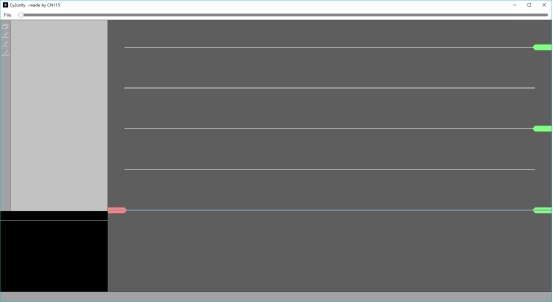 

如果在开始时选择导入文档，编辑器会要求导入歌曲文件和保存有谱面信息的谱面文件（.json）。

 

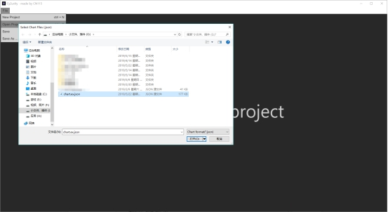 

 

现在，你已经准备好开始使用编辑器了。

 

### 二、界面

Cy2unity 的界面如下。

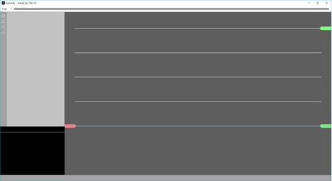 

 

最上方是菜单栏。目前只有“File”选项卡，日后会添加其他新功能。进度条放在了菜单栏上，你可以在非播放时拖动进度条来调整播放位置。

最左边是工具栏，目前有四个工具可以使用，下文将会详细说明。

紧贴着工具栏的灰色部分是检视窗口，用来查看、修改各项信息。

主体部分是编辑区。部分功能在鼠标指针离开编辑区后将无法使用。编辑区中央的蓝线是时间线，红线为节拍线。

正下方的是底栏，用于显示一些当前信息。保存成功的提示会显示在这里。

左下角是预览窗口，可以实时预览游戏中将会出现的效果。

### 三、菜单栏

点击菜单栏中的“File”选项卡，你会看到如下的下拉框

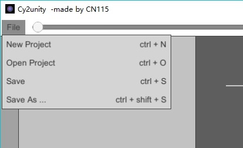 

其中，“New project”表示新建新的工程，“Open project”表示打开一个工程。“Save”表示保存，“Save as …”表示在新的位置另存工程。其对应的快捷键在后方分别注明

### 四、工具栏

工具栏自目前只有四个工具，上而下依次是“修改信息”，“音符画笔”，“速度编辑”，“精准添加”。

1、修改信息

点击修改信息后，你将看到检视窗口中出现如下画面。

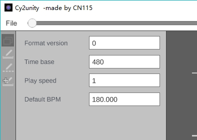 

C2的谱面文件的根节点有三个基本信息，分别为“format_version”、“time_base”、“offset”。此处可以修改其中的两个。

“Play speed”是谱面的播放速度，基础值是1。

“Default BPM”是谱面的默认BPM，修改它会更改第一个BPM节点的值。

此处强烈不建议用户对这一页进行修改

2、音符画笔

点击第二个工具，你将看到如下画面。

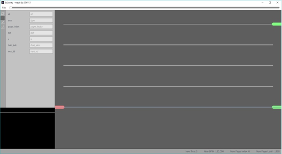 

音符画笔是目前最主要的工具。其功能如下：

(1) 在编辑窗口的空白位置点击鼠标左键来创建一个点击音符。

(2) 在编辑窗口的空白位置按住鼠标左键后向上拖拽来创建一个长按音符。

(3) 在编辑窗口的空白位置点击鼠标右键来创建一个滑动音符。

(4) 在编辑窗口的空白位置按住鼠标右键后向上拖拽来创建一组锁链。

(5) 鼠标左键可以选中和拖动音符。

(6) 鼠标右键按住锁链的最后一个音符并向上拖拽可以延长这个锁链。

(7) “D”键可以删除一个音符或者锁链的一个节点。

(8) 当选中锁链时，按“Ctrl + D”来删除整条锁链。

注意，你可以使用滚轮来调节时间，“Tab”键来开关垂直吸附线，“Shift+鼠标滚轮”来调节小节线密度，“Ctrl + 鼠标滚轮”来调节缩放。

3、速度编辑

点击第三个工具后，你将看到如下画面

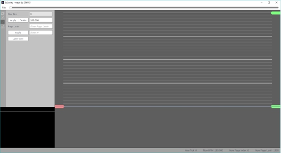 

第三个工具分为两个功能：修改BPM以及修改每页的长度。

 

BPM修改功能：

 

当前的时间位置没有BPM更改时，检视窗口会显示如下画面。

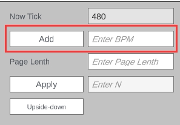 

此时在红框中输入新的BPM并点击添加，这个新的BPM将应用给接下来的时间。

若当前位置有BPM更改，检视窗口会显示如下画面。

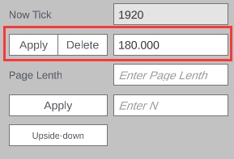 

此时可以修改这个值或删除这个BPM变化。请务必不要删除第一个BPM变化。这会造成软件崩溃。

请勿添加非常小的数甚至是负数。一般情况下来说，这个数字不要低于30。

 

每页长度修改功能：

 

在BPM修改的下方，有如下几个组件：

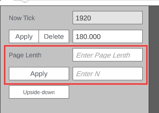 

在这里，你可以修改每页的长度。

若只在第一个编辑框中输入，如图。

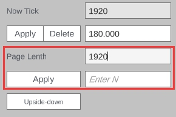 

此时点击“Apply”，将会把包括当前页在内的其后全部页的长度修改为“1920”。

若修改“Apply”右侧的“N编辑框”，如图。

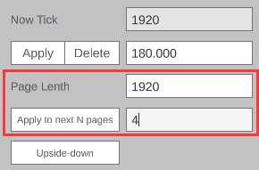 

此时点击“Apply”，只会将包括当前页在内的其后4页的长度修改为“1920”。

请勿应用给所有页一个很小的值。一般来说，这个数字应大于等于480。若需要很小的值时，请使用“Apply to next N pages”，但请注意，即便这样，也确保这个数字不会小于60。

最下方“Upside-down”按键可以将整个铺面的上下颠倒。如若原本的第一页判定线从上到下，点击按键后将变为从下到上。

4、精准添加

点击第四个工具后，你将看到如下画面。

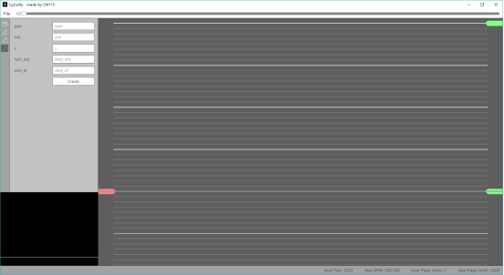 

使用该工具请参考C2谱面格式。此不赘述。

 

### 五、编辑器中的全局快捷键

| 新建工程       | Ctrl + N         | 打开工程         | Ctrl + O         |
| -------------- | ---------------- | ---------------- | ---------------- |
| 保存工程       | Ctrl + S         | 另存为……         | Ctrl + Shift + S |
| 播放/暂停      | Space            | 全屏预览         | F5               |
| 调节时间       | 鼠标滚轮         | 小幅度调节时间   | Alt + 鼠标滚轮   |
| 调节吸附线密度 | Shift + 鼠标滚轮 | 调节编辑窗口缩放 | Ctrl + 鼠标滚轮  |

 