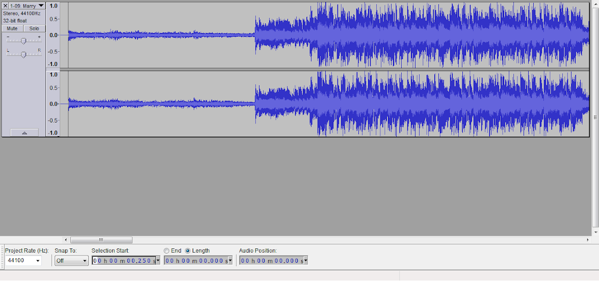
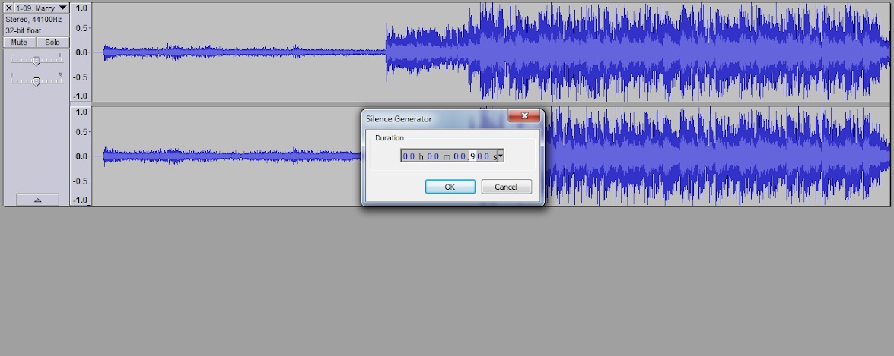
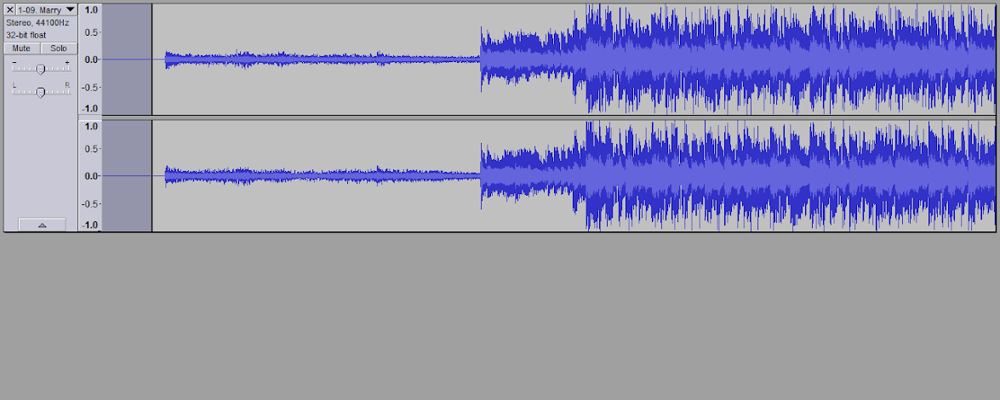
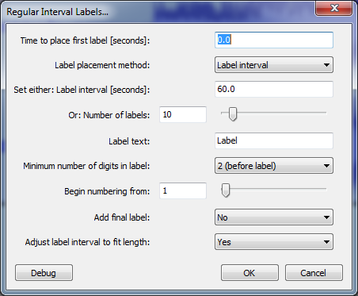
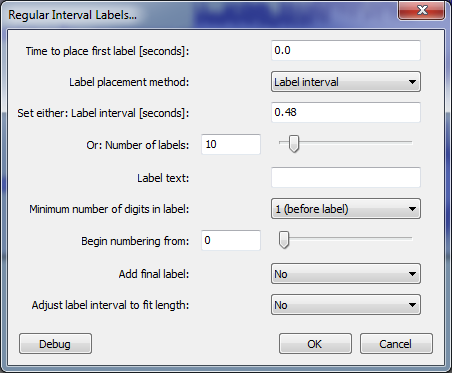
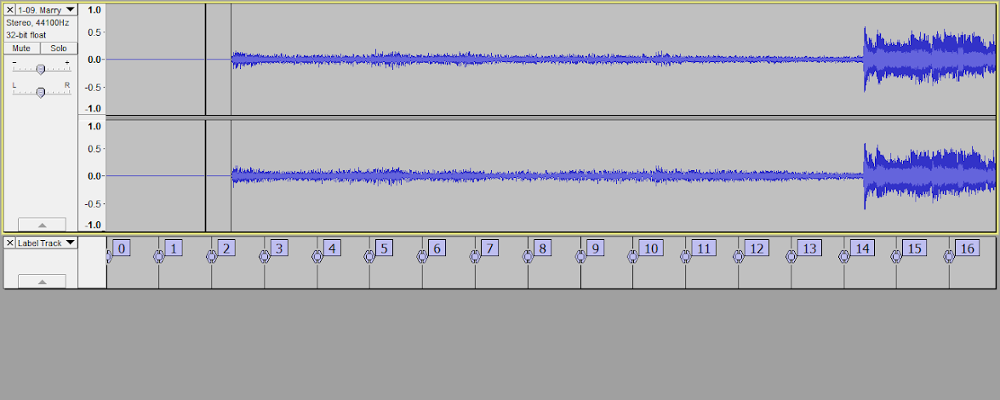
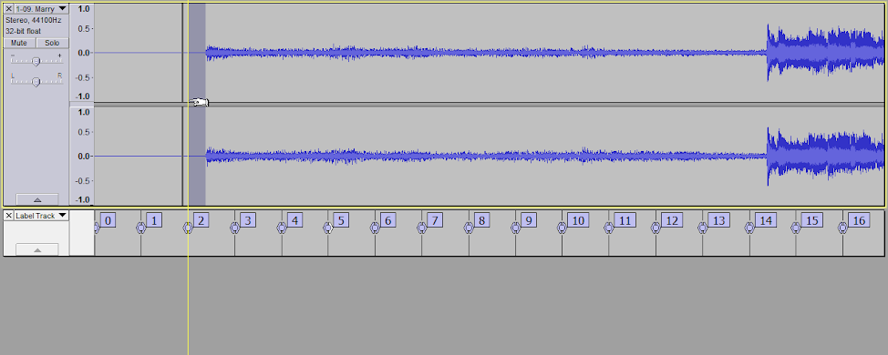
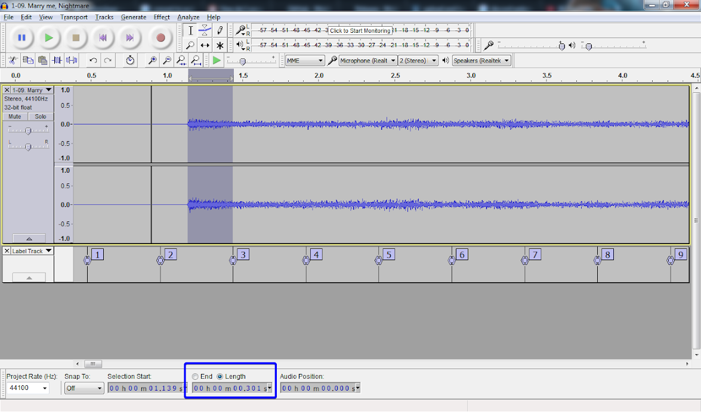
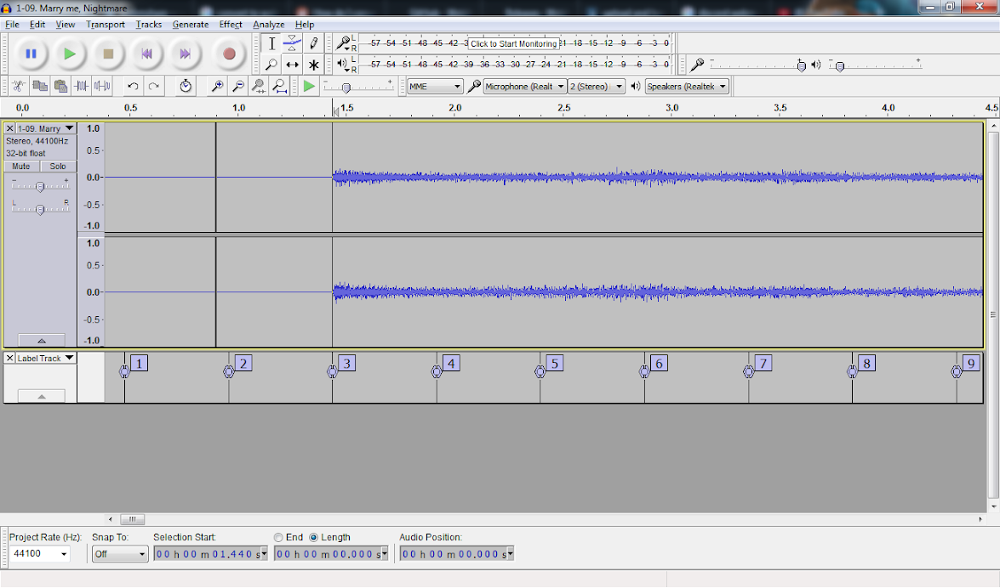

> 在您阅读本指南之前,请注意:
>
> 如果音频在0.8秒之前没有开始播放(即前0.8s内为空白),则根本不需要参阅本指南.

> 译者注：其实也需要参阅本指南。

**注意: 教程之前有误,实际上,无论是什么软件,都是使用0.8s矫正判定线,而教程在此前使用的值是0.9.编者对此感到非常抱歉**

# 前言

> 不可否认,PCTyx和Cytunity支持偏移,使得扫描线在节拍开始的同时折返,但最好将这些偏移设置为0.为什么?因为当我们将谱面从C1格式转换为C2格式时,我们想要最大的兼容性.                                                                                         **（当使用Mekko的.csv到c2转换器时,这不是必需的.）**

如果您的歌曲在0.8秒之前开始,这可能会导致您使用的制谱器(您无法在PCTyx上于0.8秒之前绘制谱面)和Cytoid(因为它花费~0.8秒矫正扫描线)出现问题.

因此,总之,此音频准备的目标是添加0.8秒并确保使用的偏移量为0.

# 要求

- Audacity (教程的版本是2.2.2)
- 你要写谱的音乐

## 向导

首先将音乐导入Audacity.您可以通过将音乐拖放到Audacity来轻松完成.在本指南中,我们使用音乐Marry Me,Nightmare,作者是t + pazolite.

正如你所看到的,音乐开始于0.250秒.这少于0.8秒.我们需要解决这个问题.

按Home键使扫描条向左移动.然后 生成 → 静音 .将持续时间设置为0.800

然后就会这样

按Alt + A选择全部音频,然后点击 分析 → 常规间隔标签(Regular Beat Intervals)  
*注意在新版本的Audacity中，“常规间隔标签”功能在“工具”菜单下而不是"分析"菜单*

能得到这样的窗口

将标签间隔(Label Interval)的值设为'120/BPM`,

如果您绘制有不同BPM的谱面,那么BPM就是您歌曲开头的BPM. 

就这里而言,Marry Me Nightmare以250 BPM开始,所以我们这里输入`120/250 = 0.48`

然后做这些: 

1. 标签文本(Label test)是可选的,我通常会清空他们,以便我可以轻松阅读.
2. 最小数字编号设置为1或2,也是便于阅读.
3. 设置从0开始编号.
4. 调整标签间隔以适合长度(Adjust label interval to fit length)必须设置为否(No).

这里是我们对于实例歌曲的配置

点击确定,你应该会得到类似的结果(如下图).

如您所见,在Marry Me Nightmare中,它从Label 2和Label 3之间的中间开始.要使PCTyx中的偏移归零,您必须在标签上开始音乐节拍. 

有2种方法,它可以编辑音乐从标签2开始或从3开始.

所以要么删除一些静音（方法1）,要么产生更多的静音（方法2）.这取决于您现有的谱面.

要做到方法1,只需从播放音乐,左键单击并拖动直到它选择标记2,然后只需按删除即可.

要进行第二种方法,请放大标签0和标签1,从音乐开头拖动到标签1.并确保将“选择”设置为“长度”而不是“结束”.

它将显示产生无声所需的持续时间.我的情况恰好是0.301.请注意.

取消选择您的选择,按Home,转到生成 → 静音,然后输入前面显示的值.

现在音乐从标签3开始.你可以在制谱器中测试.如果扫描线在小节开始时折返,那就对了.

> 译者注：我们的音源的起拍点往往不会和扫线的顶点或底端一致（即：音乐每小节开始的时候，线可能还在中间的位置）。为了精准地对音和谱面美观，我们会编辑音源，使其第一个小节的第一个音的位置为60*每页的节拍数/bpm的整数倍。所以无论你的音乐是否从0.9秒内开始，编辑音乐是必须的。
