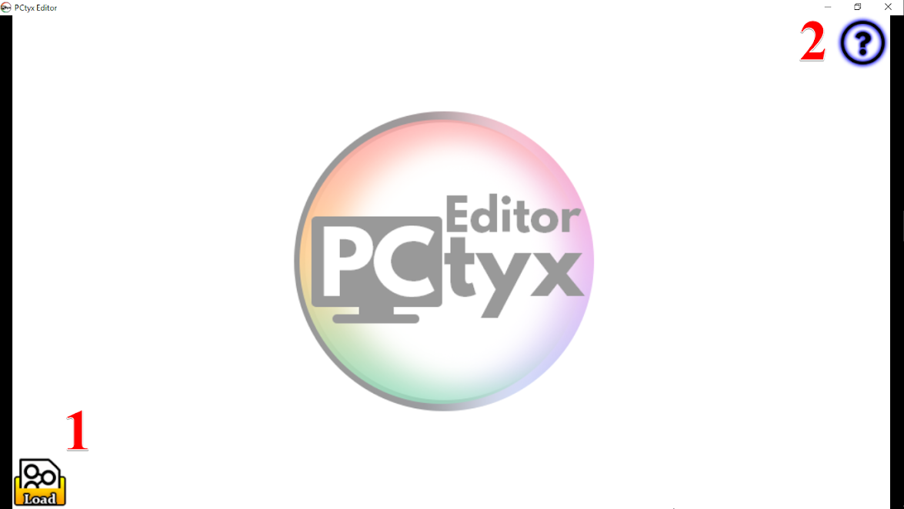
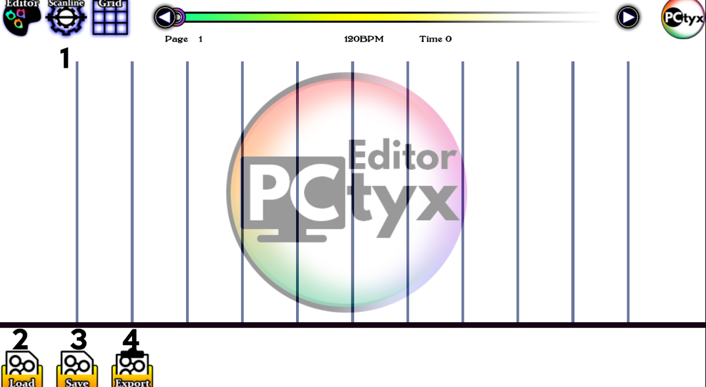
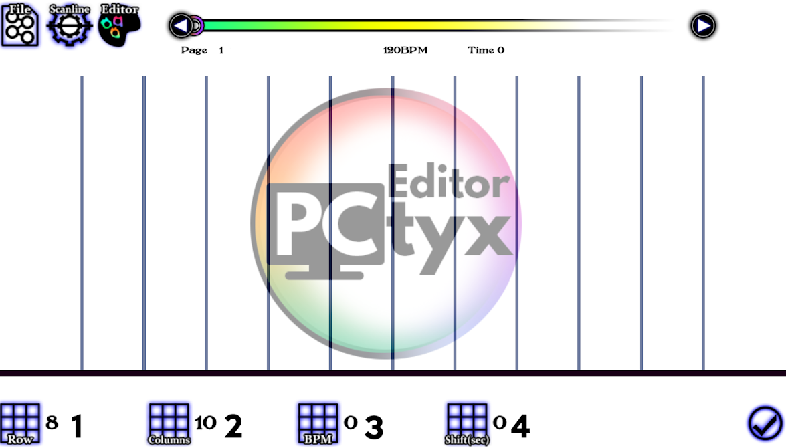
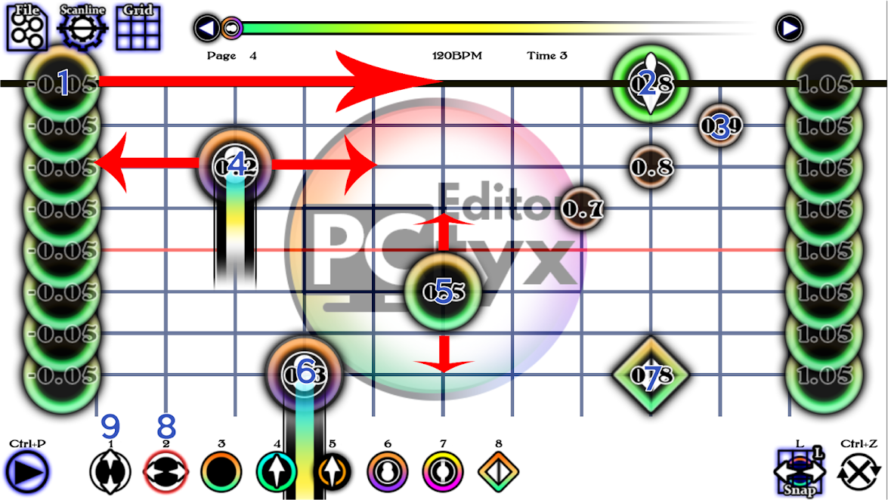
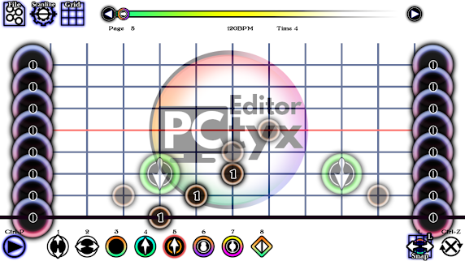
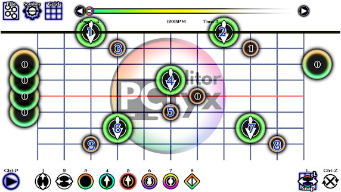

# PCTyx

PCTyx是JCEXE制作的制谱程序,也是Project Thrynox的后作。该指南已针对C2格式标准进行了更新。

这是对PCTyx制谱的介绍。CrowFX（某些部分已过时）提供了更为详细和更简单的PCTyx指南，您可以在此处查看。

- [用户界面](https://sites.google.com/site/cytoidcommunity/guides/charting/introduction-pctyx/pctyx-user-interface-old)
- [制谱](https://sites.google.com/site/cytoidcommunity/guides/charting/introduction-pctyx/pctyx-charting-old)

> 译者:这两个页面因为过时所以没翻译,请自备工具访问

## 用户界面

### I.启动

**1.** 加载按钮（Loading）：打开/继续项目。您必须打开支持的音频文件才能开始制谱。

 支持的文件格式包括：

​        **a.** 音频文件

- .mp3（Cytoid唯一支持的文件类型）
- .M4A
- .OGG

​        **b.** 谱面文件

- .csv - 保存谱面时，程序会生成的文件类型。如果你正在制作一个c2格式的谱面，请使用csv文件。
- .cytus.txt - 用于Cytus 1和Cytoid的通用格式

​        **c.** 背景视频（可选，不适用于Cytoid）

- .MP4
- .ogv

​        **d.** 背景图像（PCtyx中可选，Cytoid上是强制性的）

- .JPG
- .png

**2.** 问号(?)：为[http://cytus-fanon.wikia.com/wiki/User_blog](http://cytus-fanon.wikia.com/wiki/User_blog)的超链接。这用于检查PCtyx的更新，或向开发人员JCEXE询问/报告错误。

要启动新项目，请单击加载按钮，然后选择谱面所需的音频文件。

### II。编辑

####     A）文件选项界面 

**1.** 扫描线按钮（Scanline）：转到扫描线界面。

**2.** 加载（Load）：加载您需要的更多文件。

**3.** 保存（Save）：保存.csv文件。建议您停止制谱时，或者如果您要长时间制作谱面时每隔一小时保存一次，以防意外发生。如果您使用C2格式绘制谱面，则需要.csv才能使转换器正常工作。

**4.** 导出（Export）：仅在制作c1谱面时使用，这会将所有谱面数据转换为c1格式(将删除C2特性的note)。

#### B）扫描线界面

**1.** File：如果需要添加其他文件，按此键找到第二个界面。

**2.** Editor：使用它来转到编辑器。

**3.** Grid：使用它来转到网格。

**4.** BPM：扫描线的速度，或歌曲的BPM。在这里插入bpm，但是如果你想让扫描线与原始的bpm不同，我建议只使用x0.5，x1.0，x1.5或x2.0的倍数。可以使用任何其他内容，但请确保扫描线处于同步状态。

**5.** Shift：调整歌曲的偏移，使扫描线折返时可以匹配音乐的节拍。插入音乐第一个重拍的时间。如果使用offset，只需将其设置为0即可。(为保证兼容性,请尽量设置为0)

**6.** Offset：在此处插入偏移量。它与osu!的偏移量相同。如果shift为1.131秒，则偏移量为1131.建议使用shift。

**7.** Confirm：确认您的更改。

此处未列出：Direction

单击它，您会看到3个不同的选项：Blank，U / D和D / U。 如果您希望扫描线从顶部开始，则选择U / D。如果您希望扫描线从底部开始，请选择D / U。Blank是你不在乎的时候扫线方向的时候的选项。除非你知道你在想要什么效果，否则在大多数情况下将它留空是更好的。

#### C）网格对齐屏幕 

**1.** 行（Row）：取决于你的BPM，8和16是4/4拍音乐制谱的常用行数。如果您没有选择正确的grid，您将很难将note对音。

**2.** 列（Column）：制谱时你想要多少列，18,6,24,12和20是很常用的值。

**3.** BPM：没有意义。

**4.** Shift（网格）：设置为0.001。

#### D）编辑界面

**1.** 游玩测试（Playtest）：查看您的谱面。

**2.** 移动y轴：垂直移动note。

**3.** 移动x轴：水平移动note。

**4.** 点击note（click）：将您的note类型更改为click，也可用于删除note。

**5.** 锁链头note（drag）：将note类型更改为锁链头。您可以按Q键分配锁链ID以增加ID值，按E键以减少ID值。具有相同ID值的锁链将被连接，而不同的锁链将不会链接。请参考谱面格式的锁链部分。

**6.** 子锁链note：将note类型更改为子锁链note类型。与5类似操作。

**7.** 长按note（hold）：将您的note类型更改为长按note类型。使用Q增加hold时值，使用E减少hold时值。您可以使用右键单击和左键单击实现相同的功能。

**8.** 黄条（长按）note（Long hold）：将您的note类型更改为黄条note。仅适用于c2格式。使用c2类型note时，请务必保存为.csv。在写谱过程中，黄条note建议使用长按note替代，因为csv到c2的谱面格式转换器会自动转换跨屏hold为黄条（或者hold在一屏中的时间过长）。

**9.** 侧划note（flick）：将note类型更改为侧划note。仅适用于c2格式。

**10.** 自动对齐：取消选择时，note不会自动对齐到最近的网格。水平移动note时不建议这样做。

**11.** 撤销：撤销您对该页面的更改。

**12.** 页面导航：拖动小圆圈，您可以使用它来浏览所有页面。当您在页面中移动1页时，请使用向左箭头和向右箭头。

#### I）放置note，使用hold

可以使用数字8对应的选项首先放置note。单击它或按键盘上的“2”。

- 可以从两侧拖动note以将其作为click（note 1）。两侧的note超出了谱面范围，并且不会出现在游戏中。
- 现有note可以水平移动（note 4）。按住左键单击按钮的同时拖动note，然后将note移动到所需位置。note上的值显示了note在x轴上的位置。x轴note的可游玩范围是x∈[0,1]。

可以使用数字9对应的选项移动note出现的时间。单击它或按键盘上的“1”。

- 现有note可以垂直移动（note 5）。按住左键单击按钮的同时拖动note，然后将note移动到所需位置。note上的值显示note的时间（以秒为单位）。

您可以使用左键和右键单击来调整hold的时值。

- 在note 4中，您可以使用左键单击（增加）和右键单击（减少）来调整hold时值。您可以添加/删除的保留时间取决于您的网格大小。
- 您可以在按“E”键代替左键单击，按“Q”键代替右键单击。这也适用于为drag分配ID值时的操作。

要将note更改回click，请按键盘上的“3”并单击要还原的note。这会将其更改为点按note。如果您要删除note，并且该note为click，点击该note并重复一次上述操作。

Note 2和3是锁链头和子锁链的示例。

Note 6和7仅适用于c2格式的谱面。Note 6是long hold（或者跨屏hold），note 7表示flick。

#### II）锁链

如果y轴上的一个页面上有多个锁链，想要锁链不连接，当光标在note上时，按Q或E为每个note分配一个“连接值”。具有相同值的那些note将被连接，而具有不同值的那些将不会。请注意，子锁链note不能与锁链头相关联，但子锁链可以与子锁链相关联。这是一个例子：

- **在任何情况下** ID值时，锁链头1都不能与锁链头2连接。
- 子锁链3 **在任何情况下**都不能与锁链头4连接。
- 锁链头2：ID值是**不同的**时，不能与子锁链3连接。
- 当ID值**在任何情况下**都相同时，子锁链8和子锁链9无法连接。如果它们具有相同的ID值，则两个子锁链将从Playtest中**隐藏**。
- 如果锁链头1和2以及锁链头2的ID值相同，这将导致PCtyx中的错误。**请不要这样做**。
- 如果锁链头4是子锁链，并且子锁链1,3,4有相同的ID值，则**所有三个note将被链接。**
- 跨屏锁链会在note有**相同的ID值**且**无头锁链存在**的情况下运转。

  
